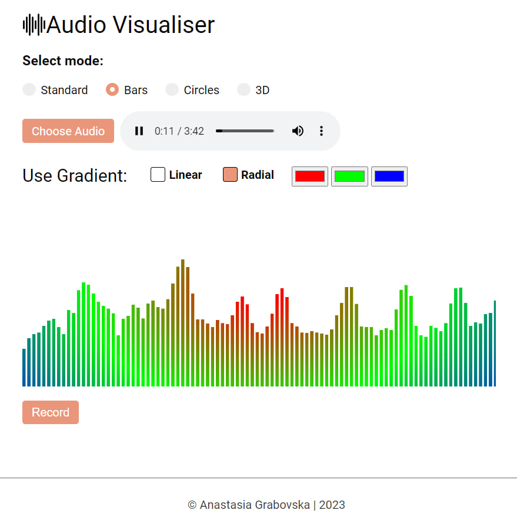

# Audio Visualiser

## Webpage

https://grabelka.github.io/audio-visualiser/

## Description

The Audio Visualizer is a web-based application that provides real-time visualization of audio input. It takes audio from an audio file and generates visually stunning graphics based on the audio data. 

## Key Features

- **Audio File Support:** Upload and visualize audio from files in popular formats such as MP3, WAV, and Ogg.

- **Customizable Visual Effects:** Choose from various visualization styles, including waveform, frequency bars, particle effects and 3d.

- **Color Customization:** Customize the color scheme and gradient to create visually appealing effects.

- **Download Audio Visualization:** Save the audio-visual content generated by this application as a video file for offline viewing or sharing. 

- **Responsive and User-Friendly:** The visualizer adapts to different screen sizes, making it accessible on various devices.

## Screenshots

## Technologies Used

- HTML5
- CSS3
- JavaScript
- Web Audio API
- Three.js